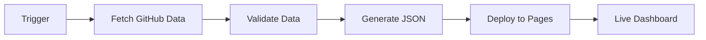

<div align="center">

# 📊 GitHub Repository Analytics Dashboard


### Advanced Analytics & Insights for GitHub Repositories

[](https://fabriziosalmi.github.io/repos/)
[](https://github.com/fabriziosalmi/repos/stargazers)
[](LICENSE)
[](https://github.com/fabriziosalmi/repos/commits)

**[🌐 View Live Dashboard](https://fabriziosalmi.github.io/repos/)** • **[🚀 Quick Start](TUTORIAL.md)** • **[📖 Documentation](SETUP.md)** • **[✨ Features](FEATURES.md)**

---

## 📈 Live Statistics

<div align="center">


**🏆 Most Starred: certmate (1127 ⭐) | 💻 Top Language: Python (55 repos) | 📊 Avg: 36.5★ / 222.4 commits**

</div>

</div>

---

## 🎯 Overview

A powerful, privacy-focused analytics dashboard that transforms GitHub repository data into beautiful, interactive visualizations. Built with modern web technologies and automated through GitHub Actions for real-time insights.

## ✨ Features

### 🎨 **Modern, Interactive UI**
- **Dark Mode Design**: Professional GitHub-themed interface with smooth animations
- **Responsive Layout**: Perfect experience on desktop, tablet, and mobile
- **Real-time Search**: Instant repository filtering with debounced search
- **Advanced Filtering**: Filter by language, status, fork status, and more

### 📊 **Advanced Analytics**
- **Interactive Charts**: Language distribution, stars comparison, activity timeline, fork analysis
- **Statistical Insights**: Repository trends, growth metrics, and engagement data
- **Language Statistics**: Detailed breakdown of technologies used across projects
- **Activity Tracking**: Repository update frequency and commit patterns

### 🚀 **Performance & Privacy**
- **Zero Tracking**: No cookies, no analytics, no data collection
- **Fast Loading**: Optimized assets and lazy loading for instant performance
- **Cached Data**: Smart caching system to reduce API calls
- **Progressive Enhancement**: Works even with JavaScript disabled (basic view)

### 🤖 **Automation & CI/CD**
- **GitHub Actions**: Automated daily updates via scheduled workflows
- **Auto Deployment**: Automatic build and deploy to GitHub Pages
- **Data Validation**: Comprehensive validation before publishing
- **Error Recovery**: Robust error handling and fallback mechanisms

---

## 🚀 Quick Start

### Prerequisites

- **Python 3.8+** for data generation
- **Node.js 18+** (optional, for frontend development)
- **GitHub Personal Access Token** (for API access)

### 🔧 Installation

1. **Clone the repository**
   ```bash
   git clone https://github.com/fabriziosalmi/repos.git
   cd repos
   ```

2. **Set up Python environment**
   ```bash
   python3 -m venv .venv
   source .venv/bin/activate  # On Windows: .venv\Scripts\activate
   pip install -r requirements.txt
   ```

3. **Configure GitHub Token**
   ```bash
   export MY_PAT="your_github_personal_access_token"
   # Or create a .env file with: MY_PAT=your_token_here
   ```

4. **Generate Data**
   ```bash
   python stats.py
   ```
   This creates `docs/repositories-data.json` with your repository data.

5. **View the Dashboard**
   Simply open `docs/index.html` in your browser, or use a local server:
   ```bash
   python -m http.server 8000 -d docs
   # Visit http://localhost:8000
   ```

---

## 🛠️ Development

### Local Development Setup

#### **Backend (Python Data Generator)**

The Python script fetches repository data from GitHub API with advanced caching and validation:

```bash
# Install dependencies
pip install -r requirements.txt

# Run with verbose output
python stats.py --verbose

# Force refresh cache
python stats.py --no-cache

# Generate specific user stats
python stats.py --user username
```

**Key Features:**
- Smart caching (1-hour default TTL)
- Rate limit handling with exponential backoff
- Data validation and integrity checks
- Detailed progress indicators
- Backup and recovery mechanisms

#### **Frontend Development**

For UI modifications, the dashboard uses vanilla JavaScript with Chart.js:

```bash
# Install development server (optional)
npm install -g live-server

# Run with hot reload
live-server docs/

# Or use Python
python -m http.server 8000 -d docs
```

**Tech Stack:**
- Pure HTML/CSS/JavaScript (no build step required)
- Chart.js for data visualization
- CSS Grid & Flexbox for responsive layout
- Modern CSS variables for theming

---

## 📊 Data Structure

The `repositories-data.json` file contains rich metadata for each repository:

```json
{
  "name": "repository-name",
  "full_name": "user/repository-name",
  "description": "Repository description",
  "url": "https://github.com/user/repo",
  "stars": 100,
  "forks": 50,
  "watchers": 100,
  "language": "Python",
  "license": "MIT License",
  "last_update": "2025-11-16T10:00:00Z",
  "last_update_str": "2 hours ago",
  "commits": 250,
  "contributors": 5,
  "open_issues_count": 10,
  "language_stats": {
    "Python": {"bytes": 50000, "percentage": 75.5},
    "JavaScript": {"bytes": 15000, "percentage": 24.5}
  },
  "archived": false,
  "fork": false,
  "private": false
}
```

---

## 🔄 Automated Deployment

The dashboard auto-updates through GitHub Actions with multiple triggers:

### Workflow Triggers

| Trigger | Frequency | Description |
|---------|-----------|-------------|
| 🔄 **Push to Main** | On commit | Instant deployment on code changes |
| ⏰ **Scheduled** | Daily at 00:00 UTC | Automatic data refresh |
| 🖱️ **Manual Dispatch** | On demand | Trigger via Actions tab |

### Deployment Pipeline



**Workflow Features:**
- ✅ Data validation before deployment
- 💾 Automatic backup of previous data
- 🔐 Secure token handling via GitHub Secrets
- 📧 Failure notifications
- 🚀 Zero-downtime deployment

### Setup GitHub Pages Deployment

1. Go to repository **Settings** → **Pages**
2. Set source to **GitHub Actions**
3. Add `MY_PAT` secret in **Settings** → **Secrets** → **Actions**
4. Workflow runs automatically on next commit

---

## 📈 Analytics & Insights

### Available Metrics

| Category | Metrics |
|----------|---------|
| **Repository Stats** | Total repos, stars, forks, watchers, issues |
| **Activity** | Last update, commit frequency, contribution timeline |
| **Languages** | Distribution, bytes written, file counts |
| **Engagement** | Stars per repo, fork ratio, issue response time |
| **Quality** | License compliance, documentation coverage |

### Visualization Types

- 🥧 **Donut Charts**: Language distribution across repositories
- 📊 **Bar Charts**: Top repositories by stars, forks, or activity
- 📈 **Line Charts**: Repository activity over time
- 🔵 **Scatter Plots**: Correlation between stars and forks
- 📉 **Trend Analysis**: Growth patterns and forecasts

---

## 🎨 Customization

### Theming

Edit CSS variables in `docs/index.html` to customize colors:

```css
:root {
    --bg-primary: #0d1117;      /* Main background */
    --bg-secondary: #161b22;    /* Card background */
    --accent-blue: #58a6ff;     /* Primary accent */
    --accent-green: #3fb950;    /* Success color */
    --text-primary: #e6edf3;    /* Main text */
}
```

### Adding Custom Charts

Add new visualizations by extending the chart rendering functions:

```javascript
function renderCustomChart() {
    const ctx = document.getElementById('customChart').getContext('2d');
    new Chart(ctx, {
        type: 'radar',
        data: { /* your data */ },
        options: { /* your options */ }
    });
}
```

### Filtering & Sorting

Customize filter options in the JavaScript section:

```javascript
// Add custom sort option
<option value="custom">🎯 Custom Metric</option>

// Implement custom sort logic
case 'custom':
    return calculateCustomMetric(b) - calculateCustomMetric(a);
```

---

## 🤝 Contributing

Contributions are welcome! Here's how you can help:

1. **🍴 Fork** the repository
2. **🌿 Create** a feature branch: `git checkout -b feature/amazing-feature`
3. **💻 Commit** changes: `git commit -m 'Add amazing feature'`
4. **📤 Push** to branch: `git push origin feature/amazing-feature`
5. **🎉 Open** a Pull Request

### Development Guidelines

- Follow existing code style and conventions
- Add tests for new features
- Update documentation for API changes
- Ensure all checks pass before submitting PR

---

## 📄 License

This project is licensed under the **MIT License** - see the [LICENSE](LICENSE) file for details.

---

## 🙏 Acknowledgments

- **GitHub API** for providing comprehensive repository data
- **Chart.js** for beautiful, responsive charts
- **GitHub Actions** for seamless automation
- **Open Source Community** for inspiration and support

---

## 📞 Support

- 📧 **Issues**: [GitHub Issues](https://github.com/fabriziosalmi/repos/issues)
- 💬 **Discussions**: [GitHub Discussions](https://github.com/fabriziosalmi/repos/discussions)
- 📖 **Documentation**: [Setup Guide](SETUP.md)

---

## 🔒 Privacy & Security

- ✅ **No tracking or analytics**
- ✅ **No cookies or local storage abuse**
- ✅ **No external API calls from client**
- ✅ **All data fetched server-side**
- ✅ **Open source and auditable**

---

<div align="center">

**Built with ❤️ and GitHub Action☕**

[](https://github.com/fabriziosalmi)
[](https://twitter.com/fabriziosalmi)

**⭐ Star this repo if you find it useful!**

</div>
